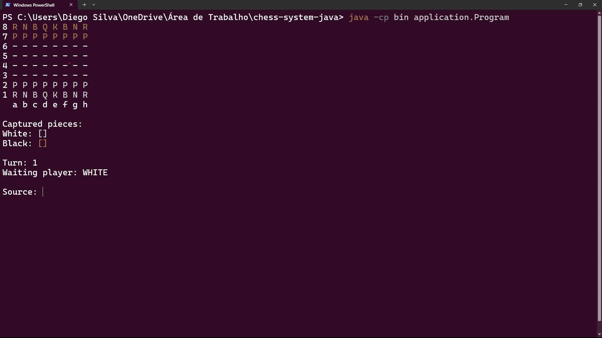

# ♟️ Chess System in Java

This repository contains a terminal-based chess game developed in Java as an educational project to demonstrate core principles of Object-Oriented Programming (OOP) in a real-world application.

The system emphasizes clean modeling, layered design, responsibility separation, exception handling, and domain abstraction between generic boardgame logic and chess-specific rules.

---

## 🔎 Overview

A fully functional chess game, playable directly in the console.  
The system is structured into two major layers:

- **Generic Layer (`boardgame`)**: reusable abstractions for any board-based game (board, pieces, positions, exceptions).
- **Specific Layer (`chess`)**: concrete implementation of chess rules, pieces, match logic, and validations.

---

## 🧱 Project Structure

- `application/Program.java`: main entry point of the application
- `application/UI.java`: handles console rendering and user input
- `boardgame/`: core abstractions (Board, Piece, Position, BoardException)
- `chess/`: chess match logic, position handling, and custom rules
- `chess/pieces/`: implementation of all chess pieces: King, Queen, Rook, Bishop, Knight, Pawn

---

## 🧰 Technologies Used

- **Java 17+**: modern Java version with improved language features
- **OOP (Object-Oriented Programming)**: encapsulation, inheritance, polymorphism, and abstraction
- **Console-based UI**: built with basic `System.in` and `System.out` I/O
- **Custom Exception Handling**: meaningful errors for illegal moves, invalid positions, and more
- **Modular Layering**: separation of concerns between board mechanics and chess rules

---

## 🎯 Design Patterns Applied

- **Adapted MVC (Model only)**: logic separation between domain and interface, even without formal controllers/views
- **Exception Pattern**: custom exceptions for rule validation and error feedback
- **Enum Pattern**: used for piece color and game state control
- **Domain Abstraction Layer**: reusable classes such as `Board`, `Piece`, and `Position` are not tied to chess only

---

## 🎮 How to Play

- The game runs entirely in the console and alternates turns between White and Black
- Players input moves using standard chess notation (e.g., `e2` to `e4`)
- All moves are validated based on piece-specific logic
- Captured pieces are displayed separately for each player
- The system handles invalid input, illegal moves, and provides error messages without crashing

---

## 🛠️ How to Compile and Run (Windows)

To run the game on Windows, follow these steps in PowerShell or Command Prompt:

1. Create the `bin` directory:

- mkdir bin 2>$null

2. Compile the Java files:

- javac -d bin src\application*.java src\boardgame*.java src\chess*.java src\chess\pieces*.java

3. Run the program:

- java -cp bin application.Program

> Make sure Java 17 or newer is installed and added to your system's PATH.

---

## 🖼️ Screenshot



```markdown

